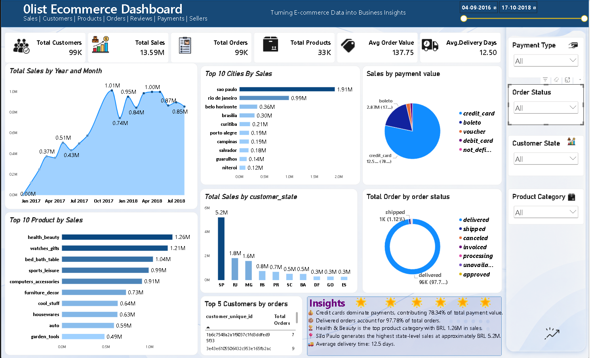

# olist-ecommerce-sql-powerbi-analysis
End-to-end e-commerce data analysis using SQL and Power BI on the Olist Brazilian dataset
## 📊 Power BI Dashboard

# Olist E-Commerce Analytics: SQL + Power BI

## 📌 Project Overview

End-to-end analysis of the Olist Brazilian E-Commerce dataset using **MySQL and Power BI**.

- ~99K Orders
- 96K Unique Customers
- 33K Products
- 9 Relational Tables
- 49 SQL Queries
- Power BI connected to MySQL using DirectQuery

**Tools:** MySQL, Power BI, DAX, GitHub

---

## 📊 Power BI Dashboard

---

## 🗃️ Dataset

9 relational tables covering customers, orders, order items, products, sellers, payments, reviews, geolocation and category translation.

---

## 🧹 Data Preparation

- Converted text dates to proper `DATETIME`
- Handled missing delivery dates
- Used `customer_unique_id` for customer analysis
- Translated product categories
- Excluded incomplete months

---

## 🧮 SQL Analysis

**49 queries** covering:

- Basic SQL & Aggregations
- Joins
- Subqueries
- Window Functions
- CTEs
- Views
- Stored Procedures

---

## 🔍 Key Insights

- Late deliveries: **2.57** avg. review vs **4.29** for on-time orders
- Repeat customers: **3.12%**
- São Paulo: **~5.2M BRL** in product sales
- Credit cards: **~78%** of payment value
- Delivered orders: **97.78%**
- Average delivery time: **12.5 days**
- Peak monthly sales: **~1.01M BRL** in November 2017

---

## 🛠️ Technologies

**MySQL | Power BI | DAX | GitHub**
